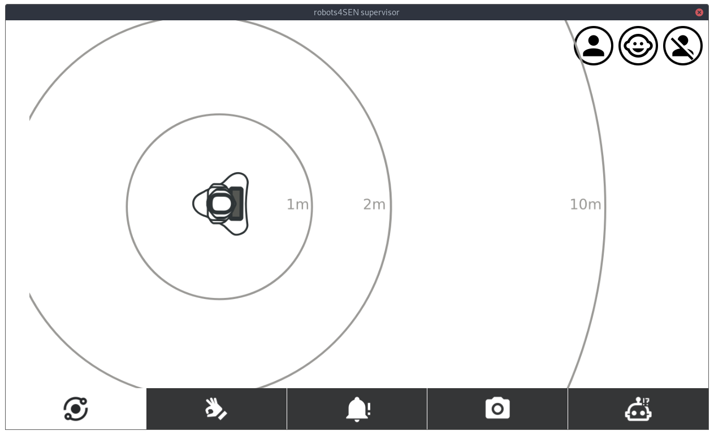

ROBOT4SEN -- Robot control
==========================




Architecture
------------

- `main.py` is the main entry point. It must be run on the computer acting as
  the supervision tablet.
- `main.py` creates (in this order):
  1. a QML-based interface for the control tablet.
  1. a bridge to the robot (instance of `NaoqiBridge` as defined in
     `naoqibridge.py`).
  1. a Flask server, that serves HTML content to be displayed on the robot's
     tablet. The Flask server lives in its own thread.
  1. a supervisor instance (as defined in `supervisor.py`), that lives in its
     own thread
- the bridge can communicate with the robot using the Python2 `naoqi` bindings;
  it also exposes QML objects that are used for the control tablet interface.
- however, none of the *input modules* (the control tablet, the robot tablet, or any other input
  methods) can **directly** execute commands on the robot. The commands they
  generate are enqueued and processed by the supervisor. **Only the supervisor
  can execute actual command on the robot**.
- However, *reading* data from the robot can be (and is) done directly by the
  other components (like the control tablet)
- communication between the input modules and the supervisor is done through a
  shared command queue (set in `main.py`)


In addition, the supervisor hosts a websocket server, to which the HTML page
served to the robot connect. This is used to trigger content changes on the
robot tablet.


Command flows
-------------

### Running an activity

1. the child presses the button 'Tell a story'. This creates a request to
   `/activity/stories/request` to the Flask server
2. the `/activity/stories` Flask endpoint has been previsouly created by
   `activities/stories/activity.py`. The route callback push a `STORIES` command to the
   supervisor queue, to request the story activity to be started.
3. `Supervisor` decides to start the activity: it get the activity with
   `get_activity()`, and
   sets it as its active activity `Supervisor.activity`. Then, in
   `Supervisor.run`, it calls the `tick()` method of the activity at a set
   frequency, until `tick()` returns the status `FINISHED` or `INTERRUPTED`.

Pre-requisites
--------------

The project **requires** Python2 as the `naoqi` bindings do not support Python3.

- `pip install pyside2 flask`
- the naoqi python SDK


Running it
----------

```
python2 main.py --ip <robot ip> --ssid <wifi network> --passwd <wifi passwd>
```

Check `main.py --help` for full list of options.


### Network configuration

Due to how the Pepper tablet works, the following netwrok configuration is
required:

- one wifi router, that acts as DHCP server
- configure the control laptop/tablet and the robot to connect to the Wifi
- configure Pepper's tablet and connect to the Wifi. For instance:

```python
tablet = session.service("ALTabletService")
tablet.enableWifi()
tablet.configureWifi("open", "<ssid>", "") # last param is passwd, if using 'wpa'
tablet.connectWifi("<ssid>")
while tablet.getWifiStatus() != "CONNECTED":
    print(tablet.getWifiStatus())
```
- make sure the Flask server serves on `0.0.0.0`

Upon startup, `main.py` will send the tablet the IP of the control laptop/tablet
where the Flask server runs, to display the corresponding HTML content.


Using a direct, wired connection to the robot for debugging is fine *once the
system is fully started*. If done too early, the control laptop default route
might not lead to sending the Pepper's tablet the right Wifi IP, renderin the
Flask server inaccessible.


Adding new behaviours
---------------------

From choregraphe (attention: choregraphe 2.5 is required; does not work with
2.8), load the `robots4sen` package, add a new behaviour (via the big '+' icon
in the *Project files* panel) and rename it as appropriate, implement the
behaviour, upload it to the robot (from the *Robot applications* panel).

Next time you start the supervisor, your behaviour should be listed alongside
the other ones (look for `Available robots4SEN behaviours` in the console).

Others
------

Pepper's tablet user-agent:
```
Mozilla/5.0 (Linux; Android 4.0.4; ALY001LG Build/LPT-100SB) AppleWebKit/537.36 (KHTML, like Gecko) Chrome/39.0.2171.71 Mobile Crosswalk/10.39.235.15 Safari/537.36
```
